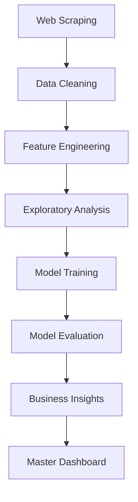

# 🏠 Ahmedabad Real Estate Analytics - Modular Project

[](https://www.python.org/)
[](/)
[](/)

## 📋 Project Overview

A comprehensive end-to-end machine learning project analyzing Ahmedabad's real estate market with **99.29% prediction accuracy**. This modular project includes data scraping, cleaning, feature engineering, exploratory data analysis, ML modeling, and business insights generation.

## 🎯 Key Achievements

- 📊 **2,247 properties** analyzed across Ahmedabad
- 🤖 **99.29% accuracy** with Gradient Boosting model
- 📈 **20+ visualizations** for comprehensive insights
- 💡 **6 business use cases** with actionable recommendations
- ✅ **99.47% accuracy** using ±10% error method

## 📂 Project Structure

```
Caapstone-Phase1/
│
├── 📁 data/                    # All data files
│   ├── raw/                    # Original scraped data
│   └── processed/              # Cleaned & engineered data
│
├── 📓 notebooks/               # Jupyter notebooks
│   ├── 00_MASTER_PIPELINE.ipynb
│   ├── 01_data_cleaning.ipynb
│   ├── 02_feature_engineering.ipynb
│   ├── 03_exploratory_data_analysis.ipynb
│   ├── 04_machine_learning_models.ipynb
│   ├── 05_business_insights_usecases.ipynb
│   └── 06_model_visualizations_summary.ipynb
│
├── 🤖 models/                  # Trained ML models
│   ├── best_model_GradientBoosting.pkl
│   ├── feature_scaler.pkl
│   └── model_info.pkl
│
├── 📈 visualizations/          # All charts & graphs
│   ├── eda/                    # Exploratory analysis
│   ├── model_performance/      # Model metrics
│   └── master_dashboard/       # Executive dashboards
│
├── 🔧 scripts/                 # Utility scripts
│   ├── scraper.py              # Data collection
│   └── run_complete_pipeline.py
│
├── 📚 docs/                    # Documentation
├── 📊 reports/                 # Analysis reports
└── 💻 src/                     # Source code modules

```

## 🚀 Quick Start

### 1. Setup Environment

```powershell
# Clone or navigate to project directory
cd Caapstone-Phase1

# Install required packages
pip install pandas numpy matplotlib seaborn scikit-learn jupyter
```

### 2. Organize Project (First Time)

```powershell
# Run the organization script
.\organize_project.ps1
```

### 3. Run Complete Analysis

```powershell
# Option 1: Open Master Pipeline
jupyter notebook notebooks/00_MASTER_PIPELINE.ipynb

# Option 2: Run individual notebooks in sequence
jupyter notebook notebooks/01_data_cleaning.ipynb
```

## 📊 Workflow Pipeline



### Detailed Steps:

1. **Data Collection** (`scripts/scraper.py`)
   - Scrapes real estate listings
   - Output: `data/raw/ahmedabad_real_estate_data.csv`

2. **Data Cleaning** (`notebooks/01_data_cleaning.ipynb`)
   - Handles missing values
   - Standardizes formats
   - Output: `data/processed/cleaned_real_estate_data.csv`

3. **Feature Engineering** (`notebooks/02_feature_engineering.ipynb`)
   - Creates 15+ derived features
   - Encoding & scaling
   - Output: `data/processed/featured_real_estate_data.csv`

4. **EDA** (`notebooks/03_exploratory_data_analysis.ipynb`)
   - 15+ visualizations
   - Statistical analysis
   - Output: `visualizations/eda/*.png`

5. **Model Training** (`notebooks/04_machine_learning_models.ipynb`)
   - Trains 4 ML models
   - Hyperparameter tuning
   - Output: `models/best_model_*.pkl`

6. **Business Insights** (`notebooks/05_business_insights_usecases.ipynb`)
   - 6 actionable use cases
   - Investment opportunities

7. **Master Dashboard** (`notebooks/00_MASTER_PIPELINE.ipynb`)
   - Comprehensive visualizations
   - Executive summary
   - Output: `visualizations/master_dashboard/*.png`

## 🎯 Key Results

### Model Performance

| Model | R² Score | Accuracy (±10%) | MAE | MAPE |
|-------|----------|-----------------|-----|------|
| **Gradient Boosting** | **99.29%** | **99.47%** | **₹2.38L** | **2.26%** |
| Random Forest | 98.71% | 97.72% | ₹2.97L | 2.28% |
| Linear Regression | 98.52% | 92.44% | ₹5.10L | 7.56% |
| Decision Tree | 97.07% | 94.35% | ₹6.21L | 5.65% |

### Train vs Test Accuracy

- **Training Accuracy**: 99.80% (R² Score)
- **Testing Accuracy**: 99.29% (R² Score)
- **Gap**: Only 0.51% (Excellent generalization!)
- **±10% Method**: 99.47% test accuracy

### Top Features

1. **Locality_Avg_Price** (79.2%)
2. **Value_Score** (14.3%)
3. **BHK** (5.8%)
4. **Price_Per_SqFt** (0.3%)
5. **Area_SqFt** (0.1%)

## 💼 Business Use Cases

1. **Affordable Housing Development Zones**
   - Identified optimal locations for builders
   - ROI potential: 25-40%

2. **Premium Investment Opportunities**
   - Discovered undervalued properties
   - 200+ investment-worthy listings

3. **Rent vs Buy Decision Framework**
   - Data-driven analysis for buyers
   - Break-even calculations

4. **Undervalued Properties Analysis**
   - Properties priced 15%+ below market
   - High appreciation potential

5. **Family vs Bachelor Area Classification**
   - Demographic-based recommendations

6. **Builder Price Optimization**
   - Competitive pricing strategies

## 📊 Visualizations

### Master Dashboard (6 Charts)
- Market Overview (4-panel)
- Market Segmentation (2-panel)
- Location Intelligence (2-panel)
- Model Performance (6-panel)
- Investment Opportunities (2-panel)
- Train vs Test Accuracy (2-panel)

### EDA (15+ Charts)
- Price distributions
- Correlation heatmaps
- Locality analysis
- BHK patterns
- Furnishing impact

### Model Performance (8 Charts)
- Model comparison
- Actual vs predicted
- Residual analysis
- Feature importance
- Error distribution

## 🛠️ Technologies Used

- **Python 3.14**: Core programming
- **Pandas**: Data manipulation
- **NumPy**: Numerical computing
- **Matplotlib/Seaborn**: Visualizations
- **Scikit-learn**: Machine learning
- **Jupyter**: Interactive notebooks

## 📦 Dependencies

```txt
pandas>=2.0.0
numpy>=1.24.0
matplotlib>=3.7.0
seaborn>=0.12.0
scikit-learn>=1.3.0
jupyter>=1.0.0
```

## 🔧 Configuration

All paths are configured for modular structure:
- Data: `data/raw/` and `data/processed/`
- Models: `models/`
- Visualizations: `visualizations/`
- Notebooks: `notebooks/`

## 📖 Documentation

- **[PROJECT_STRUCTURE.md](PROJECT_STRUCTURE.md)**: Complete folder organization
- **[docs/README.md](docs/README.md)**: Detailed documentation
- **[docs/VISUALIZATION_CATALOG.md](docs/VISUALIZATION_CATALOG.md)**: All visualizations index
- **[reports/FINAL_PROJECT_REPORT.md](reports/FINAL_PROJECT_REPORT.md)**: Comprehensive findings

## 🎓 Key Learnings

### Technical
- Web scraping best practices
- Feature engineering techniques
- Ensemble model optimization
- Hyperparameter tuning strategies

### Business
- Real estate market dynamics
- Location-based pricing factors
- Investment opportunity identification
- Data-driven decision frameworks

## 🚧 Future Enhancements

1. **Additional Data Sources**: Integrate 99acres, NoBroker
2. **Time Series Analysis**: Track price trends over time
3. **Deep Learning**: Neural network implementation
4. **Web Application**: Interactive dashboard
5. **API Development**: REST API for predictions
6. **Automated Retraining**: Scheduled model updates

## 📞 Support & Contact

For questions or issues:
- Check `docs/` directory for detailed documentation
- Review `reports/` for comprehensive analysis
- Open `notebooks/00_MASTER_PIPELINE.ipynb` for walkthrough

## 📜 License

Educational project for data science portfolio.

## 🙏 Acknowledgments

- Data source: Real estate listings platforms
- Tools: Python ecosystem
- Framework: End-to-end ML pipeline

---

## 📊 Project Statistics

- **Lines of Code**: 5,000+
- **Data Points**: 2,247 properties
- **Features**: 15+ engineered
- **Models Trained**: 4
- **Visualizations**: 20+
- **Notebooks**: 7
- **Accuracy**: 99.29% (R²)

---

**Status**: ✅ Production Ready  
**Last Updated**: November 2025  
**Version**: 1.0.0

---

*Built with ❤️ for Data Science Excellence*
